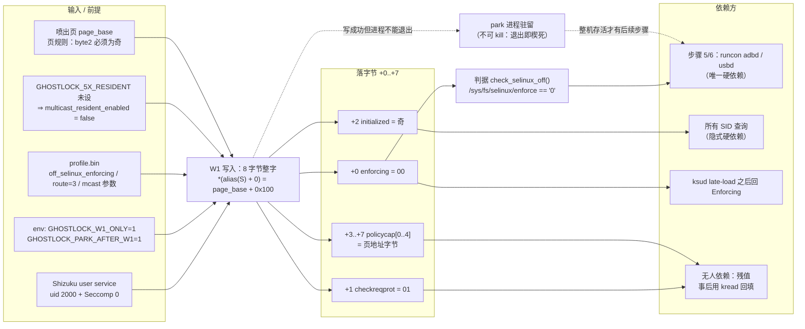
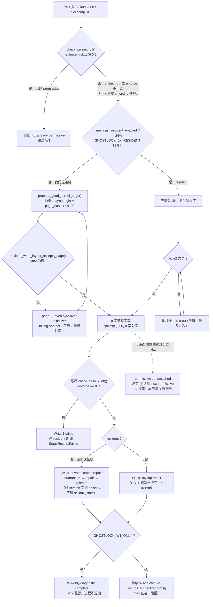

# W1 报告：SELinux permissive 注入的写入形态与隐患清单

> 范围：本文只做**记录与判读**。所有隐患**本迭代一律不处理**（边界见 §7），
> 链的命令与步骤保持 2026-09-26 冻结版本不变。
>
> **产物登记**：类型 = 分析报告（W1 写入形态 / 隐患清单 / 判读方法 / 依赖视图 + 逻辑视图）；
> 状态 = **已交付，只记录不处理**；日期 = 2026-09-27；
> 位置 = `docs/analysis/w1-report.md`；分支/提交 = `w1c-cred-copy` / `67ac079`（正文）、
> `9470c10`（两张视图）；关联产物 = app 集成链（`root-chain-status.md`、`current-chain-20260926.md`）。
>
> 相关文档：`root-chain-integration.md`（链设计）、`current-chain-20260926.md`（设备侧冻结 runbook）、
> `root-chain-status.md`（交接状态）。

## 1. W1 在链里的位置与触发条件

* 链的第 2 步（`ChainStep.W1`）。触发身份：uid 2000 + `Seccomp: 0`（Shizuku user service），
  **无 root、无 KSU**。
* 设备侧：`sh /data/local/tmp/gl-w1/w1.sh`（`tools/device/w1-selinux.sh`）；
  app 侧：`GhostlockUserService.runW1Only()` 起 `libghostlock.so`，env
  `GHOSTLOCK_W1_ONLY=1` + `GHOSTLOCK_PARK_AFTER_W1=1`
  （`app/src/main/kotlin/com/ghostlock/app/shizuku/GhostlockUserService.kt:156-168`）。
* 目的：把 SELinux 从 Enforcing 推到 Permissive，供链的第 5/6 步用 `runcon` 借
  `adbd`/`usbd` 域。`ksud late-load` 之后回到 Enforcing 是**预期行为**，不是失败。

## 2. 写入原语的本性：8 字节整字，值还兼任 walk 指针

* 两条传输走同一个语义：`*(target) = value`，waiter 的三个字是
  `{pc = value, right = 0, left = target}`，节点为 RED 所以没有颜色修复
  （`src/core/exploit_ops.cpp:237-239`）。
* **关键约束**：这个 `value` 同时就是 PI walk 要解引用的伪造 rb-tree child pointer
  （`exploit_ops.cpp:255-259`），所以它**必须是可解引用的内核地址（或 0）**。
  这一条决定了字的形状，也决定了下面 H4/H5 的存在。
* 目标地址 = `alias(selinux_state) + off_selinux_enforcing`。本机（OPPO PJA110 /
  5.15.180-android13-8）该 alias 是 `0xffffff802b3f9990`，且 W1 的字正好落在 `+0`
  （`exploit_stages.cpp:240-264`）。

## 3. 我们这条链实际写进去的字

**走的是非 resident 路线**：`multicast_resident_enabled` 默认 `false`，只有
`GHOSTLOCK_5X_RESIDENT` 才打开（`src/core/session/runtime_config.cpp:128,142-143`），
而 `w1.sh`（`tools/device/w1-selinux.sh:57-60`）与 app 侧 env 都没设它。
所以值不是 resident 分支的空零页 alias，而是喷出页推导出来的：

```
layout.right = (mode == Zero) ? page_base + 0x100 : init_cred_alias
```

（`src/core/memory/payload_builder.cpp:79-82`；`page_base` = 喷出页的内核线性别名，4 KiB 对齐。）

逐字节落到 `selinux_state` 的字段（字段顺序依据 `exploit_ops.cpp:260-261` 的注释与实测）：

| 字偏移 | 我们链里的值 | 字段 | 后果 |
|---|---|---|---|
| +0 | `00`（页对齐 ⇒ 低字节必 0） | `enforcing` | **= 0，permissive ✅ 这就是 W1 的全部目的** |
| +1 | `01`（`page_base` 低两字节 00 00，+`0x100` ⇒ 恒为 01） | `checkreqprot` | 被写成 **1**，且**每次都一样**（不是随机）→ H2 |
| +2 | 奇数（页规则强制） | `initialized` | 保住非零 ✅ → H1 说明为什么必须这样 |
| +3..+5 | 页地址中段字节 | `policycap[0..2]` | 污染 → H3 |
| +6..+7 | `FF FF`（canonical 顶部；本机 alias 是 `0xffffff80…`，实测为三个 FF） | `policycap[3..4]` | 污染 → H3 |

即 LE 内存序形如 `00 01 <odd> .. .. .. FF FF`——与"`00 any any … FF FF`"这个记忆一致，
其中第二个字节其实恒定是 `01`。

**byte2 必须是奇数**由非 resident 的页规则保证：`prepare_good_kernel_page()` 抽到偶数
byte2 的页就丢弃重抽（`src/core/util.cpp:765-772` → `payload_write_layout_accepts_page()`，
`payload_builder.cpp:120-124`，日志 `page … stores an even byte over
selinux_state.initialized; taking another`）。resident 分支不喷页，改用把地址按 `0x10000`
步进最多 8 次把 bit16 顶成 1（`exploit_ops.cpp:271-280`，日志
`resident word 0xffffff80035a2000 -> 0xffffff80035b2000 (byte 2 made odd)`，见
`memory/2026-09-23.md:353`）。

### 3.1 依赖视图（谁产出字节，谁依赖哪个字节）

读法：左半是"要给足什么才能写出这个字"，右半是"哪些字节真的有人依赖"。要点是
**只有 `+0` 与 `+2` 有依赖方**，`+1`/`+3..+7` 是无人依赖的残值。



### 3.2 逻辑视图（W1 的判定与分支）

读法：这是我们这条链（非 resident）实际走的路径；右列是 resident 才有的分支，
以及"保险失效"的那条灾难分支（H1）。注意 `enforce` **不可读**时按 enforcing 处理并照跑 W1。



### 3.3 shift 的计算（为什么只有 0 与 -4 两个可行值）

上游的 W1 是 `retry_write_stage("W1: SELinux", data_addr(SELINUX_ENFORCING), …)`
（`src/core/main.c` 原文）：**shift = 0**，写入字是 **8 字节零**。所以"上游的 shift"就是 0；
下面算的是"如果想把副产物压到最小，允许的 shift 有哪些"。

```
S = alias(selinux_state) + off_selinux_enforcing    # 本机 0xffffff802b3f9990
A = target & ~3                                     # rbtree parent/colour 吃掉低 2 位 ⇒ 落点必 4 字节对齐
命中 S 需要  0 <= d = S - A <= 7                     # enforcing 必须落在 8 字节窗口内
对齐又要求   d ≡ S (mod 4)
⇒ d ∈ { S mod 4 , S mod 4 + 4 }                      # 本机 S mod 4 = 0 ⇒ d ∈ {0, 4}
⇒ shift ∈ { 0, -4 }
```

* `-7` **不是"没生效"而是不可达**：`(S-7) & ~3 = S-8` ⇒ `d = 8` 落在 8 字节窗口之外，
  一个字节都碰不到 `enforcing`。历史 calib 分支注释写 "shift back by 7"，而实现里打印的 target
  还是未偏移的 `…9990` —— 注释与代码不一致，两次都不对（`memory/2026-09-22.md:157-162`）。
* 写入字由"期望的 8 字节"按 `d` 对齐得到。期望值（permissive 且保持其余字段）：
  `00 00 01 01 01 01 00 00`（enforcing=0 / checkreqprot=0 / initialized=1 /
  policycap[0..4]=`01 01 01 00 00`）：

| shift | d | 写入字（LE u64） | 落字节 |
|---|---|---|---|
| **0（现用）** | 0 | `0x0000010101010000` | 原字 `0x0000010101010001` 清掉最低字节（即 `RAW & ~0xFF`）⇒ 只动 enforcing；`+1`/`+3..+7` 仍是副产物（H2/H3） |
| −4（仅记录） | 4 | `0x0101000000000000` | 只覆盖 `[S-4, S+3]`：enforcing=0、checkreqprot=0、initialized=1、policycap[0]=1，**policycap[1..4] 完全不碰**，不需要修复枪 |

* 两个常量都与此前的实测/补丁记录吻合（`memory/2026-09-22.md:136-137,167-173`），可作公式的交叉验证。
* `initialized` 只有**最低位**有意义 ⇒ 判据是 byte2 **为奇**而不是"非零"：实测 `0x3a` 这种
  "非零但偶"照样算把它清掉并楔死（页规则与 `+0x10000` 步进针对的都是这一个 bit）。
  上游那个"8 字节零写"在这个 bit 上同样不合格。
* 现状：我们走 shift 0。要用 −4 必须先做 H4 的解耦（当前引擎里"写入字"与 walk 指针是同一个字），
  **本迭代不实施**。

### 3.4 "臂"（leaf / one-child）与它自带的 −8

引擎里的 "arm" 指 **rbtree 擦除的形状**，由伪造 waiter 的 `tree_entry` 三个字段决定
（`src/core/routes/multicast_waiter_route.cpp:367-400`）：

| `tree_entry` 字段 | **默认形状（我们用的）** | leaf 形状（`GHOSTLOCK_LEAF_STORE=1`） |
|---|---|---|
| `+0x00 __rb_parent_color` | `(target - 8) & ~3` | `value`（要写的字） |
| `+0x08 rb_right` | `value`（**必须非 0**） | `0` |
| `+0x10 rb_left` | `0`（`cbz x9` → Case 1） | `target` |

默认形状的落点与两个 shift：

```
parent = (target - 8) & ~3            # 低 2 位是颜色位 ⇒ 先减 8 再对齐
主写    *(parent + 8) = value         # 落点 = target & ~3（只 4 字节对齐的目标才恰好等于 target）
附带写  *(value)      = parent|color  # 默认形状独有；传下去的就是 parent ⇒ shift = -8
```

* **默认臂的 shift = −8**，两处来源：
  1. **主写坐标**：`parent = (target − 8) & ~3`、主写落在 `parent + 8` ⇒ `target = S−7` 会掉到
     `S−8`（`(S−15)&~3 + 8 = S−8`）——这正是 §3.3 "−7 不可达" 的机制；
  2. **附带写内容**：`rb_right = value ≠ 0` ⇒ 擦除时 child(=value) 被
     `rb_set_parent_color(child, parent, BLACK)` 认父 ⇒ `*(value) = (target − 8) | color`。
     实测证据：W2/cred 那次把 `init_cred+0` 写成 `target−8` 的高半字 `0xffffff8a`
     （`src/core/session/exploit_stages.cpp:55-57`）。
* **leaf 形状**：没有附带写，但 2026-09-23 实测**在本机根本不落**（enforcing 保持 `01`、
  请求的字没到）⇒ 不能当替代；有命中记录的只有默认臂。
* **TCP zerocopy 路线**：同类附带写是**地址偏 +8**：`*(value + 8) = target`
  （Case 2，`__rb_change_child(node, target, value & ~3, root)`，`exploit_stages.cpp:58-61`）。
* 与 §3.3 的分工：§3.3 算的是"W1 **目标**相对 `selinux_state` 的位移"（调用方决定，与臂无关，
  只有 0 或 −4）；本节算的是"**臂自带的 −8** 从哪来"。两者不要混。

### 3.5 pselect 臂的 `waiter_shift`：定义、算法、我们设备的状态

* **定义与消费**：profile 字段 `route.select_stack.waiter_shift`
  （`SelectStackLayout.waiter_shift`，`src/core/profile.h:163-166,247`，源字段
  `pselect_waiter_shift` `profile.h:63`）。落点规则：
  `global_word = waiter_shift + waiter_word`（`src/core/routes/route_operations.cpp:571`）→
  `set_idx = global_word / words_per_set`、`word_idx = global_word % words_per_set`（`:540-541`）
  → 分别落进 in/out/ex 三个 fd_set。单位是 **64-bit word**；
  `PSELECT_ROUTE_NFDS = 320`（`src/core/routes/select_stack_route.h:14-16`）⇒ 每集合 5 字，
  三集合共 15 字 = 120 B，正好落在 `core_sys_select` 的 256 B 栈缓冲里（这条臂的原理）。
* **算法**（`tools/extract_rs/src/derive.rs:340-400`）：

  ```
  futex_sum    = Σ(链上每一帧的 sub sp, sp, #imm)        # 从 syscall wrapper 到 futex_wait_requeue_pi
  waiter_local = futex_wait_requeue_pi 帧内 rt_mutex_waiter 局部量的 sp 偏移
  futex_waiter = -futex_sum + waiter_local
  shift        = (futex_waiter - core_sys_select 的 stack_fds 第 0 字偏移) / 8
  约束：必须非负 qword；> 3 警告「最大可行 shift 是 3」；> 16 直接报错
  ```
* **我们设备（`5.15.180-android13-8-o-01176-g6333b0dbc8ed`）没有权威值**：
  * 表里填 **0 且标注"未实测"**：`.scratch/orig-c/device-support/<release>/offsets.json:5`、
    `verify_ghostlock.py:277`、`ANALYSIS_ZH.md:136-138,202,211`；
  * 编译期默认 **`PSELECT_WAITER_WORD_SHIFT = -2`**（`src/core/target.h:78`）；
  * **2026-09-27 本机实跑提取器**（对 `.scratch/forensics/live-boot_a.img`）：
    ```
    warning: pselect_waiter_shift derivation failed:
             __arm64_sys_futex calls neither do_futex nor futex_wait_requeue_pi
    warning: using heuristic pselect_waiter_shift=-2 (6.12=0, 6.6=-2);
             unreliable for kernels with a non-inlined do_pselect middle layer
    ```
    原因：**5.15 的 `SYSCALL_DEFINE6` 多一层 `__se_sys_futex`**（pselect 侧同理
    `__se_sys_pselect6`），推导器只认 `__arm64_sys_futex → do_futex` 的直接调用 ⇒
    链识别失败、`futex_sum` 拿不到 ⇒ 退回启发式。
  * 出货 profile（`app/src/main/assets/kernel_profiles/5.15.180-….conf`）里**只有
    `multicast_waiter`**、`fallback.to = "none"` ⇒ 本机链根本不走 pselect。
* **参考实现**（`workspace/CyberMeowfia/…/exploit/src`）：通用 `SLIDE_PSELECT_WORD_SHIFT 0`、
  6.1 的 `comet-*` 目标机为 `1`（与上游表一致）；它用 fd_sets（320 fd），
  inforcqb 项目用 sigset_t 喷射（在 OPPO 上 sigset_t 只有 8 B）。
* **实算结果（2026-09-27，用 `workspace/boot/vmlinux.relative.elf` + capstone 反汇编）**：
  本机 `LTO_FULL`，`do_futex` 被**内联**进 `__arm64_sys_futex`（`futex_wait_requeue_pi` 的两个
  `bl` 调用者之一是 `0xffffffc0080fa2f8`，落在 `__arm64_sys_futex` 内部；独立的 `do_futex`
  只被 `0xffffffc0089e3be0` / `0xffffffc008b0c1d8` 调用）。逐项数值：

  | 项 | 值 | 来源（反汇编） |
  |---|---|---|
  | `__arm64_sys_futex` 帧 | `0x60 + 0x460 = 0x4C0` | `stp x29,x30,[sp,#-0x60]!` + `sub sp,sp,#0x460` |
  | `futex_wait_requeue_pi` 帧 | `0x1B0` | `sub sp,sp,#0x1B0` |
  | `waiter_local`（rt_mutex_waiter 局部量） | `0x98` | `add x27,sp,#0x98` + `add x9,x27,#0x18`(pi_tree) + `str w8,[sp,#0xD8]`(= waiter+0x40 = wake_state) |
  | `__arm64_sys_pselect6` 帧 | `0xA0` | `sub sp,sp,#0xA0` |
  | `core_sys_select` 帧 | `0x1C0` | `sub sp,sp,#0x1C0` |
  | stack_fds 缓冲区偏移 | `0x50` | `cmp x23,#0x2b`(阈值 43 ⇒ 320 fd 走栈路径) → `add x22,sp,#0x50` → `cmp x22,x8`(同一立即数对) |

  ```
  futex_waiter  = -(0x4C0 + 0x1B0) + 0x98  = -0x5D8  ( -1496 B )
  pselect_word0 = -(0xA0 + 0x1C0) + 0x50   = -0x210  (  -528 B )
  delta         = -0x3C8 = -968 B  ⇒  delta / 8 = -121 word   （负值）
  ```
  ⇒ 推导器的判据 `delta < 0 → "pselect/futex overlap is not a non-negative qword: -968"`
  直接命中：**fd_set 栈缓冲（−528 B 起、共 120 B）够不到 −1496 B 处的死 waiter，差 ~968 B
  （121 个 qword）**，也就是 pselect 这条臂在 5.15 + LTO_FULL 上**对不齐**。
  用户记忆中的 **−120** 与此只差 1 个 word（同样口径差异：`__arm64_sys_futex` 的
  `stp … [sp,#-0x60]!` 是否计入帧、或 buffer 取 `0x50`/`0x48`）——**两者都是负数，结论一致**：
  "算出来是负数"才是重点，不是某个可用 shift。
* 对照：我们换用的 MCAST/`getsockopt` 载体深度实测在 `0x7C8`–`0x7E8`（≈2 KB），
  正好覆盖死 waiter ⇒ 能落地；这也解释了为什么本机必须走 MCAST 而不是 pselect。
* 提取器在那次实跑里失败的直接原因也清楚了：它的逐符号反汇编窗口够不到
  `__arm64_sys_futex` 内部 `+0x24040` 处的内联调用点，于是报
  "calls neither do_futex nor futex_wait_requeue_pi"。

## 4. 隐患清单（**全部不处理**）

每条给：机制 / 证据 / 影响 / 为什么不处理。

### H1 `initialized`（byte2）落到偶数 ⇒ "permissive but smashed"，楔死

* 机制：`initialized` 只有**最低位**有意义（1 bit），byte2 为偶 ⇒ 该位为 0 ⇒ 之后
  **每一次 SID 查询都失败**；表现为 enforcing 确实变成 0 但**没有** `[+] SELinux permissive`，
  随后机器卡死/重启。
* 证据：2026-09-22 21:21 那次跑（用户自己跑 C++ calib 版）：8 字节落在 `+0`，实测
  `checkreqprot←0x20`、`initialized←0x3a`、`policycap[0..4]←2b 80 ff ff ff`
  （`memory/2026-09-22.md:157-162`）；该次直接导致楔死，正是注释里的 "permissive but smashed"。
* 现有保险：非 resident 的页规则 / resident 的 0x10000 步进。**保险失效就同归于尽**
  （没有第二道判据会在落地后救回来）。
* 不处理：已在链内自动规避；再加固意味着改页规则/引擎，收益与风险不成比例。

### H2 `checkreqprot` 被写成 1（byte1，恒定）

* 机制：值 = `page_base + 0x100` ⇒ byte1 恒 `0x01`，而 byte1 落在 `checkreqprot`。
  该字段是 deprecated，语义是"用请求的 prot 而不是实际 prot 做 AVC 检查"。
* 证据：代码推导（`payload_builder.cpp:79-82`）+ 同类落字节实测（`0x20` 那次，
  `memory/2026-09-22.md:161`）。
* 影响：window 内可能出现与预期不同的 AVC 判定（偏严或偏松都取决于具体操作），
  但我们链需要的操作（`runcon` 借域、`setprop ctl.*`、adb、`rmmod`、`ksud late-load`）
  在 2026-09-26 的验证跑里都没受影响。
* 为什么没人修：能修它的那句 `echo 0 > /sys/fs/selinux/checkreqprot` 在
  **W2/W3 的 fixup 脚本**里（`exploit_ops.cpp:444-445`），而 W1-only 在
  `exploit_stages.cpp:468-470` 就提前 return 了 ⇒ **我们这条链从来不执行它**。
* 不处理：回填属于"提权之后写回正常值"的范畴，用户手动 kread 处理，且不影响判定（§6）。

### H3 `policycap[0..4]` 被页地址字节污染，且我们这条链**没有**修复枪

* 机制：+3..+7 五个字节 = 喷出页地址的中段与顶部字节。**非 resident 分支没有 policycap
  修复**——那个"W1 policycap repair"（在 `enforcing+4` 再写一个 `& ~0x1fffff` 的字）是
  **resident 专属**（`exploit_stages.cpp:449-466`）；非 resident 跑的是
  `W1b: private scratch repair`，修的是私有 scratch 页里的 poison，不是 `selinux_state`
  （`exploit_stages.cpp:419-448`）。
* 影响：`policycap[]` 每个 cap 最终是 0 还是非 0，取决于**当次页选择与 KASLR 滑动** ⇒
  同一套代码在不同 run 上可能给出不同的 capability 集合（某个 cap 关掉 = 该类操作多出拒绝）。
* 这是"W1 偶发异常"的**候选解释之一，但未证实**（我们目前没有任何一次 run 的完整
  policycap 落值 + 对应失败现象），明确标注为假设。
* 不处理：同上，回填交给手动 kread；链只要求 §6 那两个条件。

### H4 不能用"精确常量"当写入值

* 机制：值兼任 walk 指针，塞非指针常量会在 PI walk 里被当 child pointer 解引用。
* 证据：2026-09-22 用 `0x0101000000000000` 试了三次，全部在 `mcast prep done` 之后、
  `resident write` 之前立刻 panic（`exploit_ops.cpp:286-291`）。
* 影响：想要"只改第一个字节"的简洁方案在当前引擎里不可用；必须把"存入的字"与
  "walk 用的指针"解耦（老引擎的做法是 `pselect_w1_shift_word` 把 `fake_right` 覆盖成
  可解引用地址，见 `payload_builder.cpp:111-115` 对 `util.c:758` 的引用）。
* 不处理：解耦要改引擎核心 + 重跑真机验证，而当前形态已验证可用。

### H5 把目标往前挪也解决不了（`-7` 从来就是无效的）

* 机制：store 地址只保证 **4 字节对齐**（`parent = target - 8` 且 stamp 里 `(target-8) & ~3`）
  ⇒ `S-7` 取整成 `S-8`，**根本碰不到 `enforcing`**；而 `S-4` 虽然能对齐，但要让
  enforcing 收到 0x00 就必须让字里 byte4 = 0x00，而"页对齐指针"的 byte4 恒为 `0x80..0xff`
  （`exploit_stages.cpp:222-230`）。
* 证据：calib 分支注释写的是 "shift the target back by 7 … so nothing else is touched"，
  但打印出来的 target 是**未偏移的** `…9990` —— 注释与表达式不一致（实现 bug），
  于是 8 字节仍落在 `+0`，这就是 2026-09-22 那次楔死的直接原因（`memory/2026-09-22.md:157-162`）。
  真正可行的是 `S-4` + 精确词方案（分支 `w1-shift4`，commit `c7d203b`，`BinW1` run
  `35733460268` success）：落 `[S-4..S-1]=0 / [S]=0 / [S+1]=0 / [S+2]=01 / [S+3]=01`，
  `policycap[1..4]` 完全不碰、不需要修复枪（`memory/2026-09-22.md:167-173`）。
* 不处理：那是另一套引擎（原始 C 版）的补丁，当前 C++ 引擎没合，且 H4 决定它在这里要先解耦。

### H6 W1 之后那个 park 进程不能 kill

* 机制：进程退出时内核会沿伪造的 PI/futex waiter 做清理 ⇒ 楔死/重启。
* 证据：脚本与文档里明确 `parking after W1: forged PI state kept alive (pid=…);
  do NOT exit/kill this process`（`tools/device/w1-selinux.sh:22-24`）。
* 影响：唯一的干净退出是重启；这也意味着"失败重试"要整机重启，不是重跑脚本。
* 不处理：链按用户要求不做收尾（park 留着，靠重启还原）。

### H7 平台反制 / 上报

* 机制：`oplus_security_guard`（uid/gid 转换策略，命中即 kill + `KEVENT_ROOT_EVENT`）、
  `oplus_secure_harden`（原语特征启发式 → `KEVENT_HARDEN_EVENT`）、
  `oplus_security_keventupload`（genl → userspace → dump/reboot）三层。
* 证据：实测有过"W1 落地后不久系统被重启"；这也是 W1 之后必须**尽快**做掉两条特权命令、
  不允许拉长 permissive 窗口的原因。
* 不处理：反制不在本迭代范围（另见链的设计文档）。

### H8 状态不持久

* 机制：重启后 `oplus_security_guard` 等模块回归，SELinux 回 Enforcing，`selinux_state`
  也复位。
* 影响：**每次 boot 都要重跑整条链**（app 内一键的意义就在这里）。
* 不处理：这是已知设计约束。

### H9 残留污染窗口：W1 → `ksud late-load` / 重启

* 窗口内 `checkreqprot` = 1、`policycap[]` = 页地址字节，直到策略重载或重启；
  `enforcing` 由 `ksud late-load` 回 1（预期），`initialized` 本来就保住。
* 不处理：见 §6——判定只看 enforcing/initialized；正常值回填用手动 kread 做。

## 5. 判读方法（从日志反推这次落了什么）

| 日志行 | 含义 |
|---|---|
| `W1: SELinux target=0x… (8-byte word, byte 2 made odd)`（`exploit_stages.cpp:264`） | 本次目标地址（相对 alias 无偏移即 `+0`） |
| `page … stores an even byte over selinux_state.initialized; taking another`（`util.cpp:766-767`） | H1 的保险在重抽页（说明确实有页被丢弃） |
| `resident word 0x… -> 0x… (byte 2 made odd)`（`exploit_ops.cpp:277`） | **只有 resident 分支**才打印；出现即说明这次不是我们链的路线 |
| `W1 policycap repair failed`（`exploit_stages.cpp:462`） | resident 专属修复枪失败（非 resident 不会有这行） |
| `Write 1 complete` 且**同时**有 `[+] SELinux permissive` | 真正成功；只有前者没有后者 = H1 的 "permissive but smashed" |

## 6. 为什么这些隐患不影响链（判定充分条件）

* 链对 W1 的**唯一判据**是 `check_selinux_off()`：读 `/sys/fs/selinux/enforce` 是否为 `'0'`
  （`src/core/exploit_ops.hpp:32-41`）。
* 之后所有特权动作依赖的是"SID 查询可用"，也就是 `initialized != 0`。
* 因此结论（用户 2026-09-27 确认，与代码一致）：**只要 `enforcing == 0x00` 且
  `initialized != 0x00`，其余字节写脏不影响提权逻辑**；需要正常值时事后写回即可
  （用户手动用 kread 回填，实测无副作用）。

## 7. 边界：明确不做的事

1. 不改 W1 的目标地址、写入字、页规则与步进逻辑。
2. 不给 app 链增加"回填/收尾"步骤（沿用 2026-09-26 用户指令：不需要考虑收尾）。
3. 不把 §4 的任何隐患做成自动修复；正常值回填一律手动 kread。
4. 若将来要处理（**仅记录，不实施**）：最少改动是把 resident 的 policycap 修复与
   `echo 0 > /sys/fs/selinux/checkreqprot` 前移到 W1 之后——但那会动到冻结链，
   必须重跑一次真机验证；彻底的方案是 H4 的解耦 + `S-4` + 精确词。

## 8. 证据索引

* 代码：`src/core/exploit_ops.cpp:237-239,255-297,444-445`、
  `src/core/session/exploit_stages.cpp:216-264,419-470`、
  `src/core/memory/payload_builder.cpp:70-83,108-126`、
  `src/core/util.cpp:738-785`、`src/core/session/runtime_config.cpp:128,142-143`、
  `src/core/exploit_ops.hpp:32-41`、
  `tools/device/w1-selinux.sh:22-24,36-60`、
  `app/src/main/kotlin/com/ghostlock/app/shizuku/GhostlockUserService.kt:156-168`。
* 实测记录：`memory/2026-09-22.md:107-116,138-142,157-173`、`memory/2026-09-23.md:353`、
  `MEMORY.md:281`。
* 设备/构建事实：route=3 MulticastWaiter、`mcast_waiter_off=32`、tcp6 carrier、
  `alias(selinux_state)=0xffffff802b3f9990`（`tools/device/w1-selinux.sh:6-10`）。
